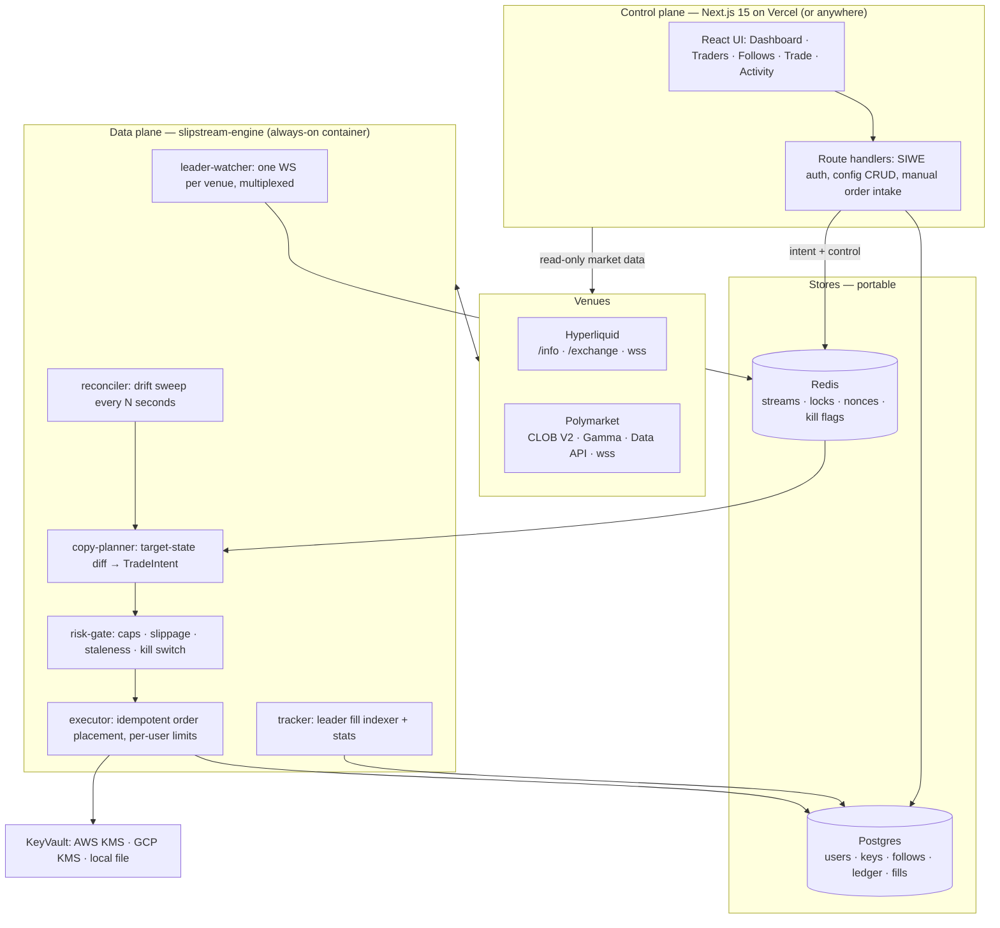

# Slipstream — Technical Plan

**A free, open-source, hosted copy-trading and manual-trading terminal for Hyperliquid and Polymarket.**

Follow any wallet on either venue, mirror it with real risk controls, and trade manually from the same screen. MIT licensed, zero fees, no token, no premium tier. Hosted at slipstream (Vercel + a worker host) and equally runnable with `docker compose up` on your own box.

**The one-sentence differentiator:** every other tool in this space asks for a private key that can drain your account. Slipstream structurally cannot move your money — it only accepts delegated trading keys that both venues make un-withdrawable at the protocol level, and it refuses to store anything else.

> **This is a planning pass. No application code exists yet. These documents are for review before anything gets built.**

| Doc | Covers |
|---|---|
| [docs/01-architecture.md](docs/01-architecture.md) | three-plane topology, why Vercel can't run the engine, package layout, provider portability, stack decisions |
| [docs/02-venues-and-data.md](docs/02-venues-and-data.md) | the `VenueAdapter` interface, Hyperliquid vs Polymarket reality, rate limits, market data, money math |
| [docs/03-copy-engine.md](docs/03-copy-engine.md) | **target-state reconciliation** (the core call), sizing modes, the staleness gate, exits-are-sacred, the decision ledger |
| [docs/04-security-and-custody.md](docs/04-security-and-custody.md) | the un-withdrawable key rule, envelope encryption, threat model, kill switches, legal posture |
| [docs/05-frontend.md](docs/05-frontend.md) | screens, information architecture, the onboarding wizard, the trust surface |
| [docs/06-roadmap.md](docs/06-roadmap.md) | six phases, each independently demoable, with exit criteria and a risk register |
| [docs/07-prior-art.md](docs/07-prior-art.md) | what already exists, what it gets wrong, what we steal, sources |
| [docs/08-build-fleet.md](docs/08-build-fleet.md) | the ~20-agent build structure, wave plan, model split, brief format |

---

## 1. Headline decisions

Each is argued in its doc. These are the calls that, if wrong, cost the most to reverse.

| # | Decision | Short version | Doc |
|---|---|---|---|
| 1 | **Three planes: Vercel app + always-on engine + shared stores** | Vercel Hobby cron fires *once per day* and WebSockets cap at 5 minutes. A copy bot needs a socket open 24/7. The engine therefore cannot live on Vercel — and that forced split is the good design, because the engine is then a plain Docker container that runs anywhere | [01 §1](docs/01-architecture.md) |
| 2 | **Copy by mirroring *position state*, not by replaying trade events** | The naive design replays fills; miss one event and the follower desyncs permanently. We instead treat the leader's position as a target, compute the follower's desired position as a scaled function of it, and diff against reality. Events are only triggers to recompute. Self-healing and idempotent by construction | [03 §2](docs/03-copy-engine.md) |
| 3 | **We only ever accept keys that cannot withdraw** | Hyperliquid agent wallets and Polymarket session signers can trade but provably cannot move funds. We verify delegation on-chain before storing a key and reject anything else. Full database breach = bad trades, never stolen funds. This is the whole trust story | [04 §1](docs/04-security-and-custody.md) |
| 4 | **Entries are gated, exits are unconditional** | Every risk gate — slippage, staleness, exposure caps, market allowlists — applies to opening and increasing only. A leader closing a position always closes yours. A gate that can block an exit is a gate that bankrupts users | [03 §5](docs/03-copy-engine.md) |
| 5 | **Both venues in v1, behind one adapter interface** | Retrofitting a second venue into a single-venue codebase costs far more than building the seam now. It's also the actual differentiator: nobody credibly does perps *and* prediction markets in one risk engine | [02 §1](docs/02-venues-and-data.md) |
| 6 | **TypeScript end to end** | `@nktkas/hyperliquid` and `@polymarket/clob-client-v2` are both first-class TS. No Python service, one language, one type system from the order struct to the React component | [01 §5](docs/01-architecture.md) |
| 7 | **Every decision is logged, including the ones where we do nothing** | "We did not copy this trade, because the price had already moved 4.2% past the leader's fill" is more valuable to a user than any chart. The decision ledger is a product feature, not a debug log | [03 §7](docs/03-copy-engine.md) |
| 8 | **Manual trading shares the executor and the risk gate with copy trading** | One code path places orders. Your global exposure cap therefore also protects you from your own manual clicking, which is a feature and not an accident | [03 §8](docs/03-copy-engine.md) |
| 9 | **A deterministic venue simulator ships in Phase 0, before the engine** | You cannot develop a copy engine against mainnet, and testnet doesn't have whales to copy. Recorded fill streams replayed against a fake venue is the only way this gets tested honestly | [06 §Phase 0](docs/06-roadmap.md) |
| 10 | **Zero fees, builder code shipped disabled** | MIT, no fee take, no token. The Hyperliquid builder-code hook exists in the codebase and defaults to empty/off; self-hosters may set their own. Keeps the option open without spending the credibility now | [01 §7](docs/01-architecture.md) |
| 11 | **Postgres + Redis, both behind boring interfaces** | Neon/Supabase/RDS/local — any Postgres. Upstash/Elasticache/local — any Redis. No Vercel-proprietary storage anywhere, so "switch providers" is a connection string, not a migration | [01 §4](docs/01-architecture.md) |
| 12 | **Paper mode is a first-class runtime, not a test fixture** | The same engine, the same gates, the same ledger, with the executor swapped for a simulated fill model. It's how a user evaluates a leader before risking money, and how we regression-test the engine | [03 §9](docs/03-copy-engine.md) |

## 2. System in one picture



The control plane never places an order and never holds a plaintext key. It writes intent and reads state. Everything latency-sensitive or secret-bearing happens in the engine.

## 3. What Slipstream deliberately is not

- **Not a signal service.** We do not rank, recommend, or endorse traders. We show you what a wallet actually did, with unflattering statistics, and let you decide.
- **Not custodial.** We never hold funds, and we cannot. See [docs/04](docs/04-security-and-custody.md).
- **Not a strategy backtester.** Paper mode is forward-looking only. Backtesting prediction-market copy strategies honestly requires order-book reconstruction we won't have in v1.
- **Not multi-chain.** Two venues, done properly, beats six venues done badly.
- **No token, no fees, no premium tier, ever.** If hosting costs become real, the answer is a donation link and a one-click self-host, not a paywall.

## 4. The uncomfortable truth we design around

Copy trading is structurally late. The leader's own trade is part of why the price moved. Every honest analysis of Polymarket copy trading in particular concludes that naive mirroring loses money to slippage: a whale buys at 0.38, and by the time a follower executes, the book is at 0.61.

We do not pretend to solve this with speed. We solve it with **refusal**: a copy that would execute worse than a configured distance from the leader's own fill is not executed at all, and the user is told exactly that, in the UI, with the number. Most competing bots hide this behind a fill notification. Making the skip visible is the product.

The corollary is that Slipstream will sometimes copy far less than a user expects. That is the correct behaviour and the onboarding says so out loud.

## 5. Monorepo layout

```
slipstream/
├── PLAN.md, README.md, LICENSE (MIT)
├── docs/                          # these documents
├── apps/
│   ├── web/                       # Next.js 15 App Router — UI + API routes
│   └── engine/                    # long-lived Node 22 worker — the actual bot
├── packages/
│   ├── venues/                    # VenueAdapter interface + hyperliquid/ + polymarket/
│   ├── copy/                      # target-state planner, sizing modes, gates
│   ├── risk/                      # limit evaluation, exposure math, kill switch
│   ├── exec/                      # executor, idempotency keys, retry, reconciliation
│   ├── tracker/                   # leader fill indexing, trader statistics
│   ├── vault/                     # KeyVault interface + kms/gcp/local implementations
│   ├── db/                        # Drizzle schema, migrations, typed queries
│   ├── shared/                    # zod contracts, decimal money math, env config, logger
│   └── testkit/                   # venue simulator, recorded fixtures, scenario runner
├── infra/                         # Dockerfile, docker-compose.yml, per-provider deploy recipes
└── scripts/                       # fixture recorder, key-rotation tooling, seeders
```

## 6. Open items for the reviewer

These are the questions I could not settle from documentation alone. Each has a stated fallback so the plan is not blocked.

1. **Polymarket delegated-signer verification.** The deposit-wallet flow gives us a signer that can trade but not withdraw, which is what we need. What I could not confirm from docs is whether a *third party* can programmatically verify, on-chain, that a given signer is not the owner EOA. There are also open SDK issues around POLY_1271 order placement binding API keys to the EOA rather than the deposit wallet. **Fallback:** ship Polymarket copy behind an explicit consent screen that names the residual risk, and verify what we can (owner-EOA mismatch) rather than everything. Resolved by a spike in Phase 0.
2. **Hyperliquid address rate limits vs. small accounts.** Limits are 1 request per 1 USDC of cumulative lifetime volume, after an initial 10,000-request buffer. A brand-new small account can genuinely run out of actions. **Fallback:** surface a remaining-actions meter in the UI and have the planner batch aggressively. Needs measurement, not a decision.
3. **Engine sharding across IPs.** Hyperliquid's 1200 weight/minute is *per IP*, shared by every user on one engine instance. **Fallback:** the engine is stateless per-shard by design, so the answer is more containers on more IPs; the open question is only when that becomes necessary. Not a v1 blocker.
4. **Whether hosted copy trading is a regulated activity for you specifically.** It plausibly is in several jurisdictions once real users are onboarded. This is a lawyer question, not an engineering one, and it should be answered before the hosted instance accepts a stranger's key rather than after. Self-hosting is unaffected either way.
